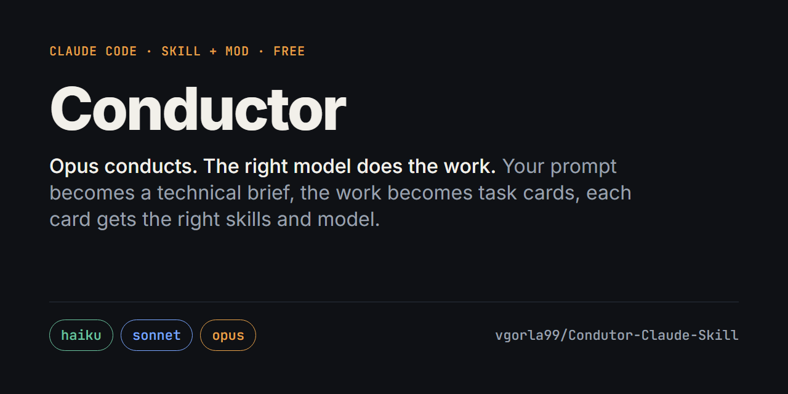
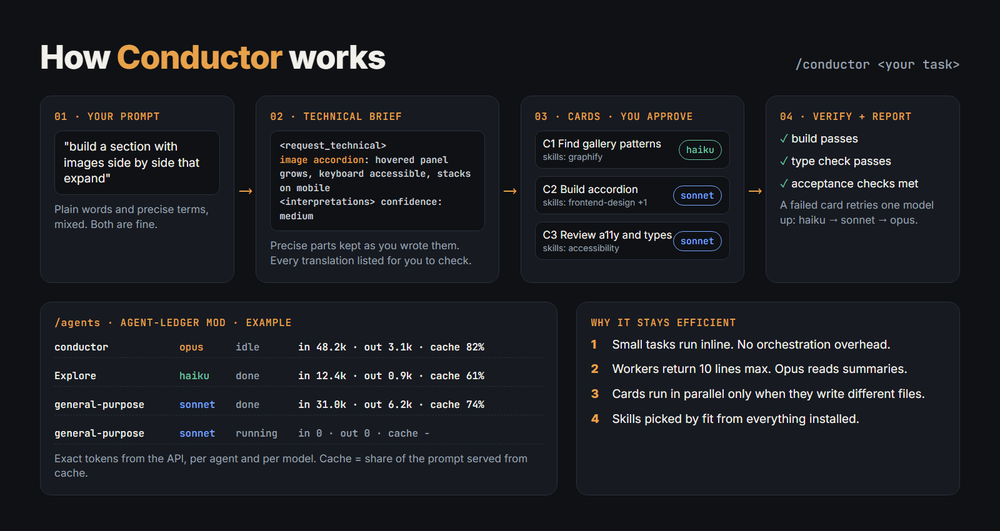
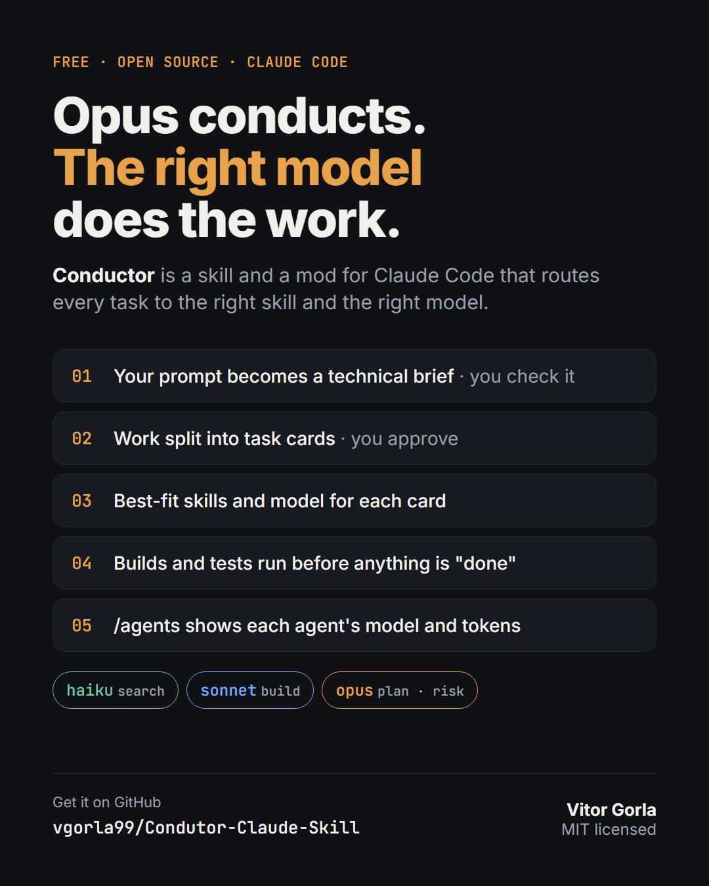

# Conductor



**An orchestration skill and a mod for Claude Code.** One Opus session acts as the conductor: it turns your prompt into a precise technical brief, splits the work into task cards, picks the right skills, agent and model for each card (Haiku, Sonnet or Opus), sends the work out, checks the results itself and reports back. The `agent-ledger` mod shows you, live, which agent ran on which model and how many tokens it used.

The goal is **token and work efficiency**: every piece of work runs on the cheapest model that does it right, with the skills that fit it, and nothing is done twice. It is not "spend less at any cost".



```
You: /conductor <task>
 │
 ▼
CONDUCTOR (main session, Opus) ─ briefs, plans, routes, verifies. Never does the bulk work.
 │ 0. Gate: under 3 independent tasks? Work inline, no orchestration.
 │ 1. Brief: your words → precise technical XML brief, interpretations listed for you to check
 │ 2. Plan: task cards in tasks/todo.md → you approve
 │ 3. Skills: searches every installed skill, picks a primary + supporting skills per card
 │ 4. Route: Haiku first for tight cards; model always set explicitly
 │ 5. Dispatch: parallel only when cards write different files
 │ 6. Verify: runs the build/tests itself; failed card retries one model up
 │ 7. Report: card · agent · model · skills · result · evidence
 ▼
WORKERS (one level only; workers never spawn workers)
 ├ Haiku:  tight cards: pattern-following code, styling, tests from spec, search (the default)
 ├ Sonnet: judgment: multi-file features, unknown bugs, reviews
 └ Opus:   architecture, hard bugs, auth, payments, data-loss risk
 ▲
AGENT-LEDGER MOD ─ /agents: every agent, its model, status, tokens and cache share
```

## What's in this repo

| Path | What it is |
| --- | --- |
| `plugins/conductor/skills/conductor/SKILL.md` | The conductor skill. Runs only when you invoke it. |
| `plugins/agent-ledger/` | The mod (a Claude Code plugin with a hooks module): `/agents` pane, a band above the prompt, `/agents-reset`. Includes tests. |
| `.claude-plugin/marketplace.json` | Lets you install both through `/plugin`. |

## Requirements

- **Claude Code v2.1.287 or later** for the mod (`claude --version`). The skill alone works on any recent version.
- **Access to Opus** for the conductor session. Haiku and Sonnet are used for workers.
- Works in the terminal. In the desktop app the skill works; the mod loads only through `/plugin` install (see below), since `--plugin-dir` is a terminal flag.

## Install

### Option A: manual (recommended, nothing runs unless you start it)

Clone the repo:

```bash
git clone https://github.com/vgorla99/Condutor-Claude-Skill.git ~/conductor
```

Copy the skill so `/conductor` is available:

```bash
cp -r ~/conductor/plugins/conductor/skills/conductor ~/.claude/skills/
```

Start a conductor session from your project folder, with the mod loaded for that session only:

```bash
claude --model opus --plugin-dir ~/conductor/plugins/agent-ledger
```

On Windows PowerShell, use your user folder, for example `C:\Users\<you>\conductor\plugins\agent-ledger`.

### Option B: as plugins (always available)

Inside Claude Code:

```
/plugin marketplace add vgorla99/Condutor-Claude-Skill
/plugin install conductor@conductor
/plugin install agent-ledger@conductor
/reload-plugins
```

Installed this way, the mod is on in every session (turn it off in `/plugin` → Installed), and the skill is listed under the plugin's namespace, for example `/conductor:conductor`.

## Use it

In a session started on Opus:

```
/conductor build a pricing section with three plans and a monthly/yearly toggle
```

Or start the session with the task already in it:

```bash
claude --model opus --plugin-dir ~/conductor/plugins/agent-ledger "/conductor build a pricing section with three plans and a monthly/yearly toggle"
```

Then:

| Command | What it does |
| --- | --- |
| `/conductor <task>` | Brief, cards, then waits for your approval before any work |
| `/agents` | Opens the ledger pane |
| `/agents-reset` | Clears the ledger |

## How the conductor works

### 1. The brief: your words, made precise

Your prompt usually mixes things you already said precisely with things you described in plain words. The conductor keeps the precise parts exactly as you wrote them and translates only the vague parts. Every translation is listed as an interpretation, with a confidence, for you to check.

| You say | The brief says |
| --- | --- |
| images side by side that expand | image accordion: row of panels, hovered/focused panel grows, others shrink, keyboard accessible, stacks on mobile |
| smooth transition between the videos | cross-dissolve from scene 1 to scene 2 over 1 to 2 s |
| make the page load faster | cut LCP: preload the hero image, lazy-load below the fold, split the largest bundle |

These are illustrations of the method, not a fixed list. The brief is XML:

```xml
<brief>
  <context>project, stack, relevant files and existing patterns</context>
  <request_original>your words, verbatim</request_original>
  <request_technical>the same request in precise vocabulary</request_technical>
  <interpretations>
    <item confidence="medium" original="images side by side that expand">image accordion (not a carousel)</item>
  </interpretations>
  <constraints>your rules from CLAUDE.md / AGENTS.md</constraints>
  <acceptance>2 to 5 checks that prove it is done</acceptance>
  <out_of_scope>what not to touch</out_of_scope>
  <task>one sentence</task>
</brief>
```

### 2. Task cards

The brief becomes cards in `tasks/todo.md`, one per independent piece of work, each with the files it writes, the files it must not touch, its skills, agent, model and acceptance checks. You approve or adjust them before anything runs.

```markdown
### C1 Build image accordion component
- writes: src/components/ImageAccordion.tsx
- forbidden: everything else
- skills: primary frontend-design (builds the component); supporting make-interfaces-feel-better (motion polish)
- agent: general-purpose | model: sonnet | effort: medium
- acceptance: hover and focus expand; stacks under 640px; tsc passes
```

### 3. Skills: picked by fit from everything you have installed

There is no fixed skill list and no cap. For each card the conductor searches all installed skills (names and descriptions), shortlists the ones that fit the card's technique and stack, reads the top of each SKILL.md to settle overlaps, then picks one **primary** skill and only the **supporting** skills that add something the primary lacks. Each skill costs context, so each must earn its place. If nothing fits, it says so instead of forcing a match.

### 4. Model routing

| Model | Used for |
| --- | --- |
| Haiku 5.5 | the default for any card that passes the **spec test** (exact files to write, an existing pattern to follow, acceptance a command can verify): pattern-following components, styling, single-file features, tests from a spec, form wiring, config, docs, search |
| Sonnet 5.5 | work that needs judgment: multi-file features with no pattern, debugging with an unknown cause, reviews |
| Opus | architecture, ambiguous bugs, auth, payments, migrations, data-loss risk |

Risk beats size: a one-line change to auth still goes to Opus or gets a security review. A card too big for the spec test is split, not sent to Sonnet whole. The conductor always sets each worker's `model` explicitly, because many specialist agents pin Sonnet in their own definition.

### 5. Why it stays efficient

- **Gate:** small tasks (one file, fewer than 3 independent pieces) are done inline. Orchestration has overhead; it only runs when it pays off.
- **Short returns:** every worker answers in at most 10 lines (status, files changed, evidence, open issues). Workers do the reading; Opus reads summaries.
- **Paths, not pasted files:** workers get file paths and read what they need.
- **Verification by the conductor:** it runs the build and tests itself rather than trusting a worker's "done".
- **Escalation:** a failed card retries once on the next model up (Haiku → Sonnet → Opus); a failure on Opus stops and asks you.

### 6. Optional: Codex as a second reviewer

If you use the [Codex plugin](https://github.com/openai/codex-plugin-cc) and agree that the code may go to OpenAI, the conductor can run `/codex:review --background` as a cross-provider review and route the findings as new cards.

## The agent-ledger mod

`/agents` opens a pane:

```
conductor            opus    idle     in 48.2k  out 3.1k  cache 82%
  main session
Explore              haiku   done     in 12.4k  out 0.9k  cache 61%
  Find auth hook
general-purpose      sonnet  running  in 0       out 0     cache -
  Build accordion
By model
opus     in 48.2k  out 3.1k  cache 82%
haiku    in 12.4k  out 0.9k  cache 61%
```

- **in / out:** prompt tokens (uncached + cached + cache writes) and generated tokens, as the API reports them. Exact, not estimated.
- **cache:** the share of the prompt served from the prompt cache. Higher is cheaper and faster; it is the best single number for token efficiency.
- A band above the prompt shows the last turn's tokens by model.
- No dollar figures yet: prices change, and a wrong number on screen is worse than none.

How it works: it hooks `agent.spawn` (each subagent's type, task and resolved model) and `turn.complete` (each loop's token usage, main session and every subagent). If the mod ever fails, prompts and subagents pass through untouched.

Test it:

```bash
cd plugins/agent-ledger
claude plugin validate .
claude plugin test .
```

## Conductor-Lint and agent-lint (experimental)

A second skill, **`conductor-lint`**, is Conductor plus a lint layer, so the two can be compared on the same tasks:

- **Lint gate:** uses the project's ESLint (or ruff). With none, it proposes a one-time setup card based on [Matheus Gomes' ESLint setup guide](https://github.com/soumatheusgomes/vibe-coding-toolkit/blob/main/docs/prompts/07-eslint-complete-setup.md) (MIT).
- **Line budget per card:** the worker states its approach and an estimated line count before coding, and has to justify going over. A warning, never an error, so nobody crams code to hit a number.
- **Efficiency rules:** reuse what exists, no speculative abstractions, nothing left unfinished, lint your own files.
- **One fix round:** findings are collected while cards run, fixed together at the end in one round, and whatever is left goes to you.

The **`agent-lint`** mod is ESLint for agent work. When a worker finishes it checks the lines that worker added and reports, ESLint-style, what it left behind:

| Rule | Severity | Catches |
| --- | --- | --- |
| `todo-left` | error | TODO / FIXME / HACK / XXX |
| `stub-left` | error | not implemented, `throw new Error("TODO")`, lorem ipsum, TBD, PLACEHOLDER |
| `skipped-test` | error | `.only`, `.skip`, `xit`, `@pytest.mark.skip` |
| `out-of-scope` | error | files changed outside the card's `writes` |
| `open-issue` | error | the worker's own "open issues" line |
| `eslint/<rule>` | as configured | the project's ESLint, on added lines only |
| `diff-budget` | warn | lines added over the card's budget (tests, lockfiles and generated files excluded) |
| `console-left`, `any-type` | warn | debug output, `any` in TypeScript |

Under `/conductor-lint` it sends each report back to the conductor (report mode); under `/conductor` it only records (observe mode), so plain runs are measured too. `/leftovers` opens the pane; `.agentlint.json` sets any rule to `off`, `warn` or `error`.

`agent-ledger` 0.2.0 adds named runs and exports for the comparison: `/agents-reset <label>`, `/agents-export`. How to run the comparison and the scorecard: [docs/comparison.md](docs/comparison.md).

## Customize

- **Model rubric, gate, report format:** edit `SKILL.md` sections 0, 4 and 7.
- **Ledger columns:** edit `plugins/agent-ledger/hooks/register.tsx`; run `claude plugin test` after.

## Known limits

- Routing is followed by the conductor through the skill's instructions; nothing in the engine enforces it yet (see roadmap).
- The conductor row counts the main session's own requests. If a version of Claude Code also folds subagent usage into the main turn, that row will read high; please open an issue.
- Tested on Windows 11 with Claude Code 2.1.289. Mods are a new API; events can change between releases.

## Roadmap

- **Routing guard:** an opt-in `agent.spawn` hook that enforces the rubric's model and an Opus budget.
- **Prompt cost preview:** estimate input tokens and likely output range before a turn runs.

## Share it

A ready-made card for posts (1080×1350):



The cards are plain HTML in `assets/src/`. Edit one and render it with any Chromium browser, for example:

```bash
chrome --headless=new --hide-scrollbars --window-size=1600,850 --screenshot=assets/how-it-works.png assets/src/how-it-works.html
```

## License

MIT © Vitor Gorla
